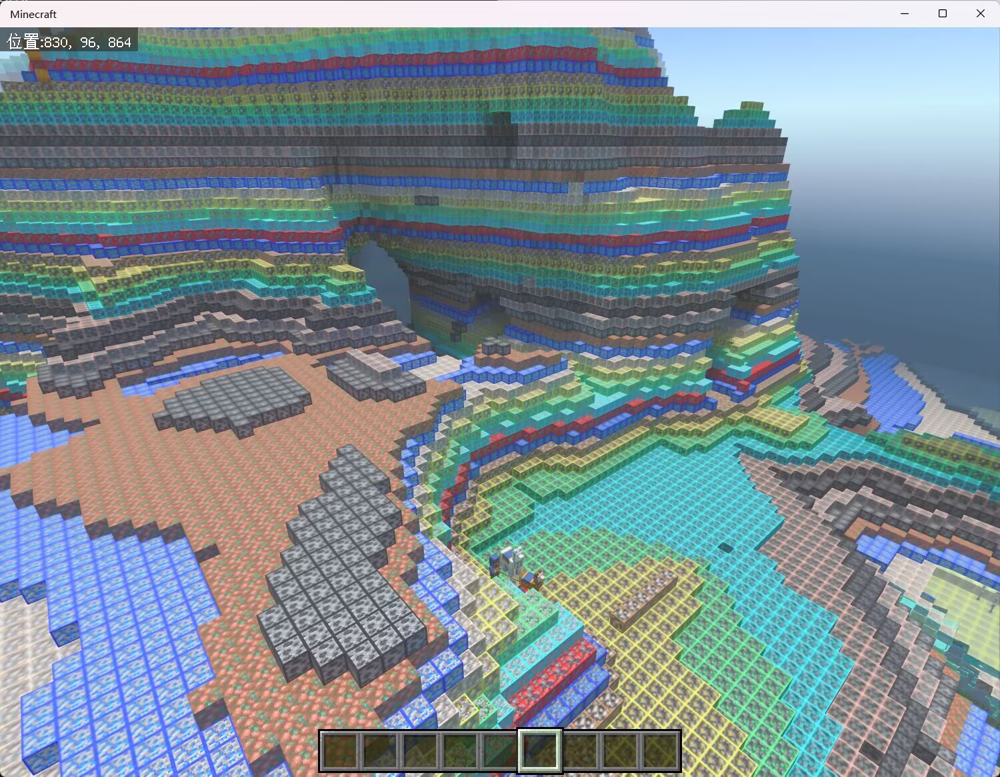

# AntiXray - High-Performance Ore Obfuscation Anti-Cheat Mod


[](README.zh.md)

[](https://qm.qq.com/q/1yn1ZHEoyY)
[](https://discord.gg/7uJNS3tNa6)

[](https://github.com/GlacieTeam/AntiXray/releases)
[](https://github.com/GlacieTeam/AntiXray/stargazers)  
[](https://github.com/GlacieTeam/AntiXray/releases)
[](https://github.com/GlacieTeam/AntiXray/issues)

This is a high-performance, highly customizable server-side anti-cheat mod designed to prevent players from using cheat clients for ore X-ray. It employs advanced multi-threaded ore obfuscation technology to ensure that the server does not experience lag due to obfuscation operations, providing a smooth gaming experience for players.

# Technical Advantages
- **Multi-threaded Processing** Distributes ore obfuscation tasks across multiple threads using multi-threading technology, significantly improving processing speed and reducing server performance overhead.  
- **Seamless Obfuscation** Uses advanced obfuscation algorithms to ensure seamless seamless obfuscation of chunk border and achieve perfect ore obfuscation, making it impossible for cheat clients to detect.  
- **Flexible Configuration** Provides detailed configuration files that allow administrators to easily adjust the types of ores, frequency, and intensity of obfuscation to meet the needs of different servers.
- **Strong Compatibility** Rigorously tested to perfectly integrate with various custom dimensions and server plugins, ensuring no conflicts with other systems or plugins and maintaining stable server operation. 
> ## Note: 
> - Due to multithreaded obfuscation on the **Endstone** platform is not memory-safe, so it is **LeviLamina Only**.
> - Due to performance issues on **Endstone** platform, highly customizable configuration files are not supported on the **Endstone** platform, so it is **LeviLamina Only**.
> - Due to the limitations of the **Endstone** platform, the speed of obfuscating blocks in chunk border on **Endstone** is over 40 times slower than on **LeviLamina**, and it cannot achieve the completely seamless obfuscation of chunk border, which is possible on the **LeviLamina** platform.

# Installation
## Endstone
1. Download the Mod File Download the latest version of the Mod file from the [Releases](https://github.com/GlacieTeam/AntiXray/releases) page
2. Place the File Place the downloaded Mod file in the `./plugins` directory.
3. Restart the Server Restart the server to load the Mod.
## LeviLamina
- Install this mod using Lip.
```bash
lip install github.com/GlacieTeam/AntiXray
```

# Configuration
## Endstone
<details>
  <summary>Endstone Configuration</summary>

```json
{
    "obfuscate_border": false  // whether obfuscate chunck border, this will incur an additional performance overhead of 3-4 times.
}
```
</details>

## LeviLamina
<details>
  <summary>LeviLamina Configuration</summary>

```json
{
    "version": 1,  // config version, do NOT modify it 
    "max_threads": 4,  // The max number of threads used by the ore obfuscation engine, setting it to 0 means using the number of physical threads.
    "auto_solid_check": true,  // whether check solid block automatically. The detection of Vanilla squares is 100% correct, but the accuracy of Addon block detection depends on the Addon author.
    "treat_addon_blocks_as_non_solid": false,  // whether treat all blocks added by Addons as non-solid block.
    "solid_blocks": [  // optional. This will be used only when "auto_solid_check" is disabled. Specify solid blocks manually instead of automatically detecting.
        "minecraft:diamond_ore"
    ],
    "non_solid_blocks": [  // optional. If AntiXray can not automatically detect some non-solid blocks (such as some addon blocks, or some solid vanilla blocks with custom non-solid resource pack), you can add them here manually.
        "minecraft:packed_ice"
    ],
    "dimensions": {  // dimension config, you can also add custom dimensions
        "minecraft:nether": {
            "enable": true,    // enable obfuscation
            "engine_mode": 1,  // obfuscation engine mode, see engine mode for more details
            "max_height": 128,  // obfuscation max block y hight, must be a multiple of 16
            "update_radius": 2,  // update block radius, set it too large may cause performance issues.
            "obfuscate_blocks": [  // if you are using engine mode 0, these are blocks will hide, else are fake ores will send to clients.
                "minecraft:ancient_debris",
                "minecraft:nether_gold_ore",
                "minecraft:quartz_ore"
            ],
            "main_block": "minecraft:netherrack"  // optional. This will only be used in engine mode 0, will send ture ores as main block.
        },
        "minecraft:overworld": {
            "enable": true,
            "engine_mode": 2,
            "max_height": 256,
            "update_radius": 2,
            "obfuscate_blocks": [
                "minecraft:coal_ore",
                "minecraft:copper_ore",
                "minecraft:deepslate_coal_ore",
                "minecraft:deepslate_copper_ore",
                "minecraft:deepslate_diamond_ore",
                "minecraft:deepslate_emerald_ore",
                "minecraft:deepslate_gold_ore",
                "minecraft:deepslate_iron_ore",
                "minecraft:deepslate_lapis_ore",
                "minecraft:deepslate_redstone_ore",
                "minecraft:diamond_ore",
                "minecraft:emerald_ore",
                "minecraft:gold_ore",
                "minecraft:iron_ore",
                "minecraft:lapis_ore",
                "minecraft:raw_copper_block",
                "minecraft:raw_iron_block",
                "minecraft:redstone_ore"
            ],
            "main_block": "minecraft:stone",
            "main_block_minus": "minecraft:deepslate"   // optional. This will only be used in engine mode 0, will send ture ores as main block when block y is minus.
        }
        // You can also add custom dimensions here
    }
}
```
</details>

# Engine Mode (LeviLamina Only)
**AntiXray has three different modes, configurable on a per dimension basis.**
- **engine-mode 0**: when `"obfuscate_blocks"` in config is covered by solid blocks on all six sides, it will be replaced with `"main_block"` or `"main_block_minus"` in config based on the dimension.
- **engine-mode 1**: when a block is covered by solid blocks on all six sides, it will be randomly replaced by a block in `"obfuscate_blocks"` in config based on the dimension. 
- **engine-mode 2**: works similarly to **engine-mode 1**, but instead of randomizing every block, it randomizes the block for each layer of a chunk.

**You can intuitively compare the effects of different engine modes through the following images.**
<details>
  <summary>Engine Mode Showcase</summary>

### No AntiXray

### Engine Mode 0

### Engine Mode 1

### Engine Mode 2

</details>

# Communication & FAQ
- Join our [Discord](https://discord.gg/7uJNS3tNa6) community: https://discord.gg/7uJNS3tNa6
- Join our [QQ Group](https://qm.qq.com/q/1yn1ZHEoyY): 642538983

# Feedback
- [Open an issue](https://github.com/GlacieTeam/AntiXray/issues) to report bugs.

# License
- [GitHub Release](https://github.com/GlacieTeam/AntiXray/releases) is the sole and exclusive official source for downloading. Any other source of download is unauthorized and constitutes illegal reproduction. 
- Unauthorized reproduction, integration, or redistribution is strictly prohibited.

## Copyright © 2025 GlacieTeam. All rights reserved.
