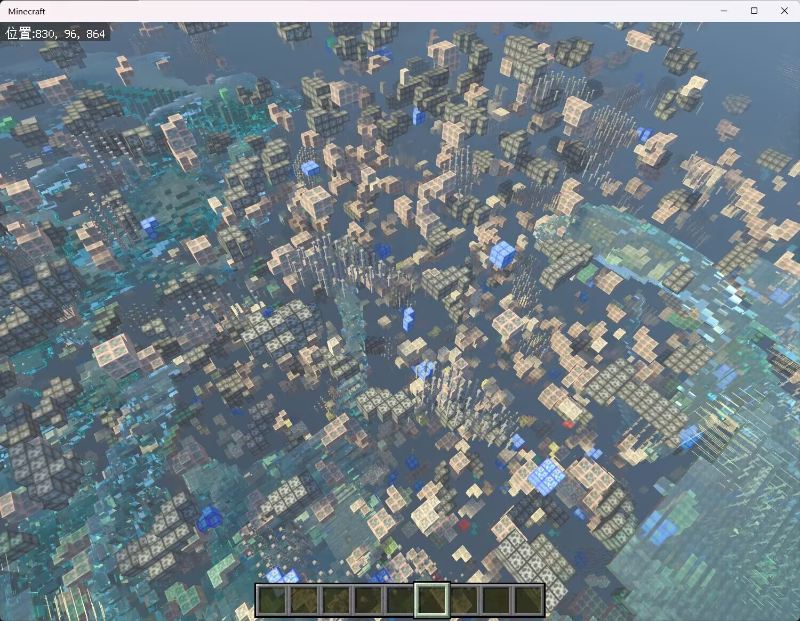
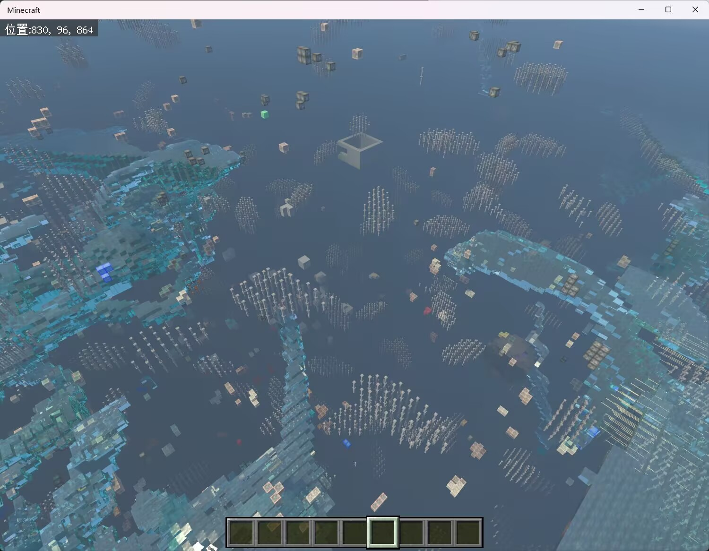
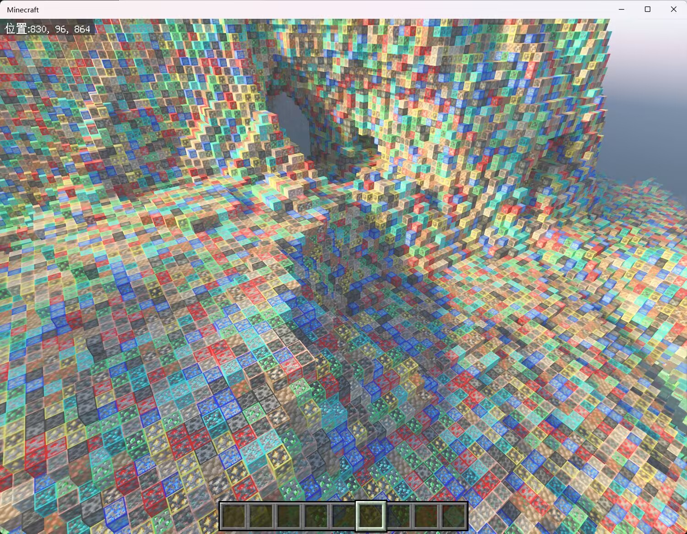
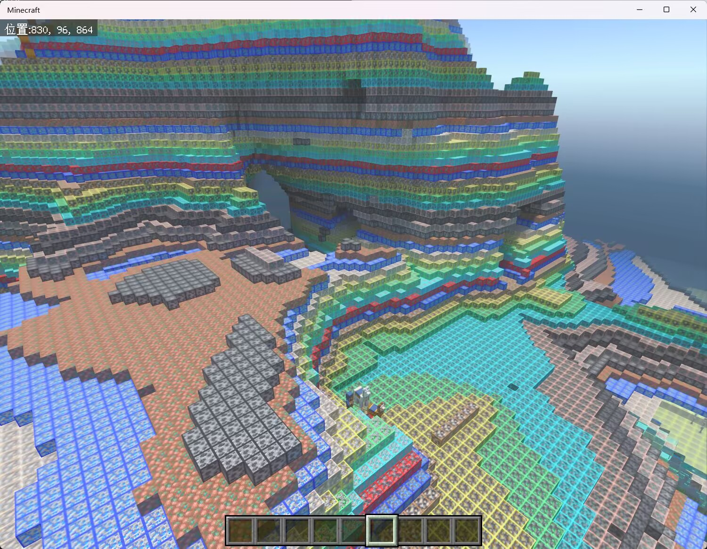

# AntiXray - 高性能矿物混淆反作弊模组

[](README.md)


[](https://qm.qq.com/q/1yn1ZHEoyY)
[](https://discord.gg/7uJNS3tNa6)

[](https://github.com/GlacieTeam/AntiXray/releases)
[](https://github.com/GlacieTeam/AntiXray/stargazers)  
[](https://github.com/GlacieTeam/AntiXray/releases)
[](https://github.com/GlacieTeam/AntiXray/issues)

这是一款专为防止玩家使用作弊客户端进行矿物透视而精心设计的高性能、高度自定义的服务器端反作弊Mod。它通过先进的多线程矿物混淆技术，确保服务器在运行过程中不会因混淆操作而出现卡顿，为玩家提供流畅的游戏体验。

# 技术优势
- **多线程处理** 通过多线程技术，将矿物混淆任务分配到多个线程中，显著提升处理速度，减少服务器的性能开销。
- **无缝混淆** 采用先进的混淆算法，确保区块边界没有缝隙，实现完美的矿物混淆效果，让作弊客户端无从下手。
- **灵活配置** 提供详细的配置文件，管理员可以轻松调整混淆的矿物种类、频率和强度，满足不同服务器的需求。
- **兼容性强** 经过严格测试，能够完美兼容各种自定义维度和服务器插件，不会与其他系统或插件产生冲突，确保服务器的稳定运行。

> ## 注意: 
> - 由于多线程混淆在 **Endstone** 平台上无法保证内存安全，此功能为 **LeviLamina独有功能**
> - 由于 **Endstone** 平台的局限性和性能问题，**Endstone** 平台上不支持高度自定义配置，此功能为 **LeviLamina独有功能**
> - 由于 **Endstone** 平台的局限性，在 **Endstone** 平台上混淆区块边界方块比在 **LeviLamina** 平台上慢40倍以上，并且无法实现像 **LeviLamina** 平台上的完全无缝的区块边界混淆

# 安装
## Endstone
1. 从 [Releases](https://github.com/GlacieTeam/AntiXray/releases) 下载最新版本
2. 将 Mod 文件放入 `./plugins` 文件夹
3. 重启服务器让服务器加载 Mod
## LeviLamina
- 使用Lip进行安装
```bash
lip install github.com/GlacieTeam/AntiXray
```

# 配置文件
## Endstone
<details>
  <summary>Endstone 配置文件</summary>

```json
{
    "obfuscate_border": false  // 是否混淆区块边界。这会带来3-4倍的额外性能开销
}
```
</details>

## LeviLamina
<details>
  <summary>LeviLamina 配置文件</summary>

```json
{
    "version": 1,  // 配置文件版本，不要修改
    "max_threads": 4,  // 矿物混淆引擎可以使用的最大线程数，设置为0使用服务器物理线程数
    "auto_solid_check": true, // 是否自动检测固态方块。Vanilla方块的检测是100%正确的，但是Addon方块检测准确性取决于Addon作者。
    "treat_addon_blocks_as_non_solid": false,  // 是否将 Addons 添加的方块都视为非固态
    "solid_blocks": [  // 可选。仅当关闭 "auto_solid_check" 时生效。通过手动指定固态方块来代替自动检测。
        "minecraft:diamond_ore"
    ],
    "non_solid_blocks": [  // 可选。如果 AntiXray 不能自动检测某些非固态方块（比如Addon方块，或者某些Vanilla方块使用了自定义的非固态材质包），你可以在这里手动添加。
        "minecraft:packed_ice"
    ],
    "dimensions": {  // 维度配置，你可以添加自定义维度
        "minecraft:nether": {
            "enable": true,    // 是否启用混淆
            "engine_mode": 1,  // 混淆引擎模式
            "max_height": 128,  // 混淆最大y轴高度，必须是16的倍数
            "update_radius": 2,  // 方块更新半径，设置过大的值会带来性能问题
            "obfuscate_blocks": [  // 引擎模式0下，这是被隐藏的方块列表，否则这是发给客户端的假矿列表
                "minecraft:ancient_debris",
                "minecraft:nether_gold_ore",
                "minecraft:quartz_ore"
            ],
            "main_block": "minecraft:netherrack"  // 可选。仅在引擎模式0下生效。被隐藏的矿物会被发送为此方块。
        },
        "minecraft:overworld": {
            "enable": true,
            "engine_mode": 2,
            "max_height": 256,
            "update_radius": 2,
            "obfuscate_blocks": [
                "minecraft:coal_ore",
                "minecraft:copper_ore",
                "minecraft:deepslate_coal_ore",
                "minecraft:deepslate_copper_ore",
                "minecraft:deepslate_diamond_ore",
                "minecraft:deepslate_emerald_ore",
                "minecraft:deepslate_gold_ore",
                "minecraft:deepslate_iron_ore",
                "minecraft:deepslate_lapis_ore",
                "minecraft:deepslate_redstone_ore",
                "minecraft:diamond_ore",
                "minecraft:emerald_ore",
                "minecraft:gold_ore",
                "minecraft:iron_ore",
                "minecraft:lapis_ore",
                "minecraft:raw_copper_block",
                "minecraft:raw_iron_block",
                "minecraft:redstone_ore"
            ],
            "main_block": "minecraft:stone",
            "main_block_minus": "minecraft:deepslate"    // 可选。仅在引擎模式0下生效。被隐藏的矿物在y轴小于0的时候会被发送为此方块。
        }
        // 你可以继续添加自定义维度
    }
}
```
</details>

# 引擎模式 (LeviLamina独有功能)
**AntiXray 有3种引擎模式，每个维度是独立配置的**
- **engine-mode 0**: 当配置文件中的 `"obfuscate_blocks"` 的6个面都是固体方块时，会使用配置文件中该维度的 `"main_block"` 或者 `"main_block_minus"` 替换
- **engine-mode 1**: 当一个方块的6个面都是固体方块时，会随机发送一个该维度的配置文件中的 `"obfuscate_blocks"` 进行替换. 
- **engine-mode 2**: 和 **engine-mode 1** 类似，但不是随机发送每一个方块，而是每一层方块，这可以减小宽带占用。

**你可以从下面的图片对比不同模式的效果**
<details>
  <summary>Engine Mode Showcase</summary>

### 无反透矿

### 引擎模式0

### 引擎模式1

### 引擎模式2

</details>

# 交流 & 提问
- 加入我们的 [Discord](https://discord.gg/7uJNS3tNa6) 社区：https://discord.gg/7uJNS3tNa6
- 加入我们的 [QQ交流群](https://qm.qq.com/q/1yn1ZHEoyY): 642538983

# 反馈
- 请通过 [提交Issue](https://github.com/GlacieTeam/AntiXray/issues) 来反馈bug

# 许可
- [GitHub Release](https://github.com/GlacieTeam/AntiXray/releases) 是唯一官方下载源。其它任何下载源都是未经授权的非法转载。
- 未经许可，严禁任何转载、整合和二次分发。

## 版权所有 © 2025 GlacieTeam, 保留所有权利.
